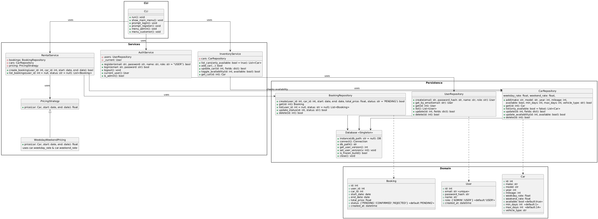

# Class Diagram — Fred's Car Rental

## Layering (Separation of Concerns)
- **CLI**: Handles menus and user I/O only.
- **Services**: Business rules.
  - `AuthService` — register/login, current user, role checks
  - `InventoryService` — list/add/update cars, toggle availability
  - `RentalService` — create bookings, list bookings, calls pricing
- **Persistence**: Data access.
  - `UserRepository`, `CarRepository`, `BookingRepository` — CRUD + queries
  - `Database` — SQLite **Singleton** that opens the DB file and enforces schema version
- **Domain**: Plain data structures.
  - `User`, `Car`, `Booking` — attributes only; booking status: `PENDING | CONFIRMED | REJECTED`

## Key Relationships
- `CLI` **uses** Services (`AuthService`, `InventoryService`, `RentalService`).
- Services **use** Repositories (e.g., `RentalService → BookingRepository` and `CarRepository`).
- Repositories **use** `Database` (single connection owner).
- `RentalService` **uses** a `PricingStrategy` interface so pricing can change without touching service code.
  - Implemented by `WeekdayWeekendPricing` (calculates using `car.weekday_rate` / `car.weekend_rate`).

## Why This Design Works
- UI, business logic, and storage are **decoupled**, making the code easier to test and change.
- Swapping pricing or storage only affects one layer (e.g., switch pricing strategy or move from SQLite to another DB).
- Tests can mock repositories or point to a temp SQLite file without modifying the CLI.

## Project Constraints (Coursework)
- No “cancel booking” flow in the model (kept simple for coursework).
- Schema version is fixed; the seeder never changes the schema.

