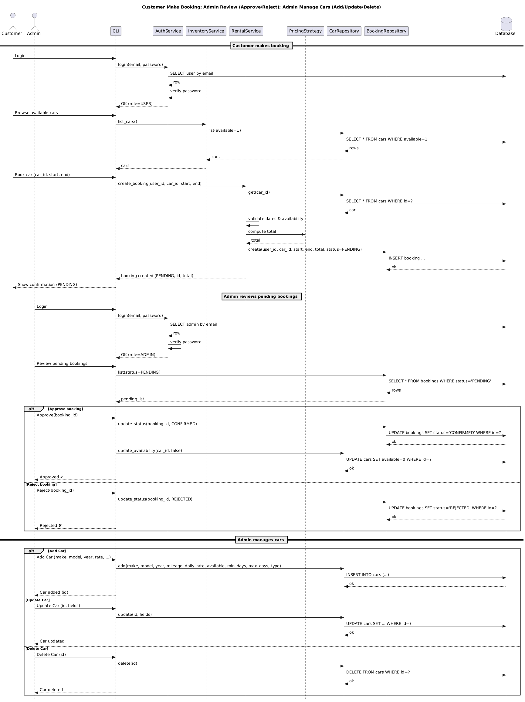

# Sequence Diagram — Fred's Car Rental

This diagram shows the **runtime interactions** between the CLI, Services, Repositories, and the Database across the main flows.

## 1) Customer Makes a Booking
1. **Login**  
   - *Customer → CLI → AuthService → Database* to verify credentials. AuthService returns the user/role.
2. **Browse Cars**  
   - *Customer → CLI → InventoryService → CarRepository → Database* to fetch **available** cars.
3. **Create Booking**  
   - *Customer → CLI → RentalService* with `user_id, car_id, start, end`.  
   - RentalService **gets car** (*CarRepository → Database*), **validates dates/availability**, then **computes price** via *PricingStrategy* (e.g., `WeekdayWeekendPricing`).  
   - RentalService **creates booking** via *BookingRepository → Database* with status **PENDING**.  
   - CLI shows **confirmation** (id + total + status).

## 2) Admin Reviews Bookings (Approve / Reject)
1. **Login as Admin**  
   - *Admin → CLI → AuthService → Database* to verify admin role.
2. **List Pending**  
   - *CLI → BookingRepository → Database* to fetch **PENDING** bookings.
3. **Approve** (Alt 1)  
   - *CLI → BookingRepository → Database* sets status **CONFIRMED**.  
   - *CLI → CarRepository → Database* sets car `available = false`.
4. **Reject** (Alt 2)  
   - *CLI → BookingRepository → Database* sets status **REJECTED** (car availability unchanged).

## 3) Admin Manages Cars (Add / Update / Delete)
- *CLI → CarRepository → Database* to **add** a car (make/model/year/rates/availability).  
- *CLI → CarRepository → Database* to **update** a car (e.g., rates, availability).  
- *CLI → CarRepository → Database* to **delete** a car.

## Notes on the Diagram
- **Actors:** *Customer*, *Admin*; **Boundary/UI:** *CLI*; **Services:** *AuthService*, *InventoryService*, *RentalService*; **Support:** *PricingStrategy*; **Persistence:** *User/Car/Booking Repositories* and *Database*.
- **Status values:** `PENDING`, `CONFIRMED`, `REJECTED` (no cancel flow in this project scope).
- **Separation of concerns:** CLI delegates logic to Services; Services **do not** perform SQL directly—they call Repositories, which talk to the Database.
- **Deterministic price calc:** RentalService always calls **PricingStrategy** so pricing can change without modifying the service.

