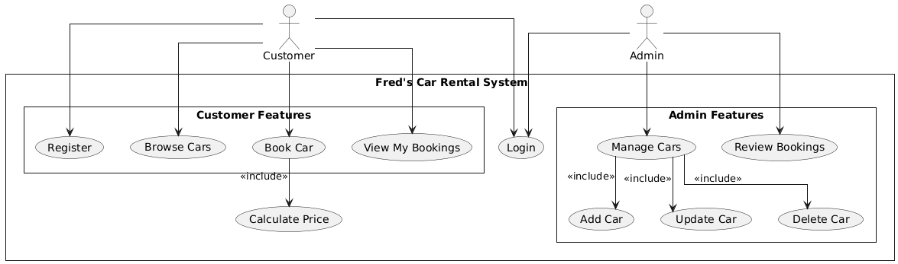

# Use Case Diagram — Fred's Car Rental (Short Explanation)

This diagram captures **who** uses the system and **what** they can do at a high level. It focuses on goals, not implementation details.

---

## Actors
- **Customer** – registers, signs in, browses cars, makes bookings, and reviews their own bookings.
- **Admin** – signs in, manages the car catalogue, and reviews/decides on customer bookings.

---

## System Boundary & Primary Use Cases
**Customer-facing:**
- **Register** – create a new account.
- **Login** – authenticate to access customer features.
- **Browse Cars** – view available cars (filters may apply).
- **Book Car** – request a booking for a date range. *(Includes **Calculate Price**)*
- **View My Bookings** – see status and details of the customer’s bookings.

**Admin-facing:**
- **Login** – authenticate with admin role.
- **Manage Cars** – administrative maintenance of the fleet:  
  *Includes →* **Add Car**, **Update Car**, **Delete Car**  
- **Review Bookings** – list and decide **Approve/Reject** for pending bookings.

**Cross-cutting:**
- **Calculate Price** – invoked during **Book Car** to compute totals using the current pricing strategy (e.g., weekday/weekend rates).

> **Note:** There is **no “Cancel Booking”** use case in this project scope.

---

## Key Relationships (from the diagram)
- **Book Car → Calculate Price**: `<<include>>` (price calculation is always part of booking).
- **Manage Cars → Add/Update/Delete Car**: `<<include>>` (management expands into these actions).
- **Login** is shared by both actors (placed near the top in the diagram to reduce line crossings).

---

## Typical Flows
- **Customer booking flow:** *Login → Browse Cars → Book Car (includes Calculate Price) → View My Bookings*  
- **Admin decision flow:** *Login → Review Bookings → Approve/Reject*  
- **Admin fleet maintenance:** *Login → Manage Cars (includes Add/Update/Delete)*

---

## Assumptions / Out of Scope
- Payments, notifications, and complex reporting are **out of scope** for this coursework.
- Pricing details are handled by a strategy component; the use case only cares that a total is returned.

